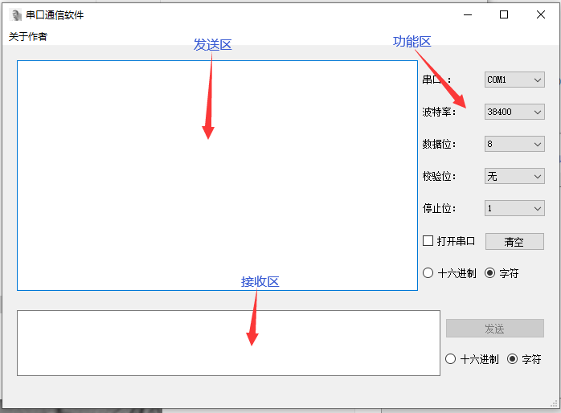
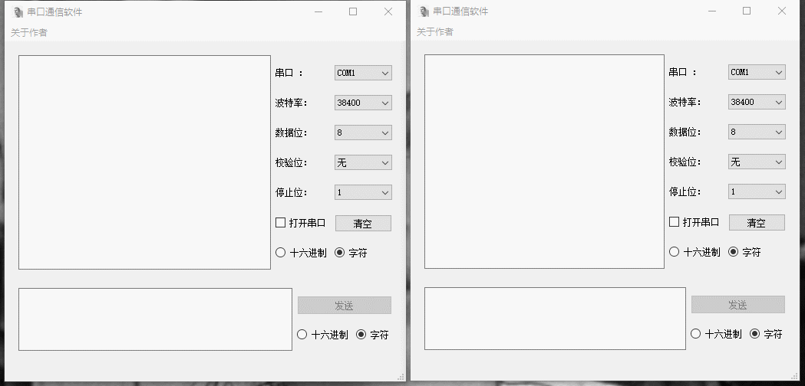
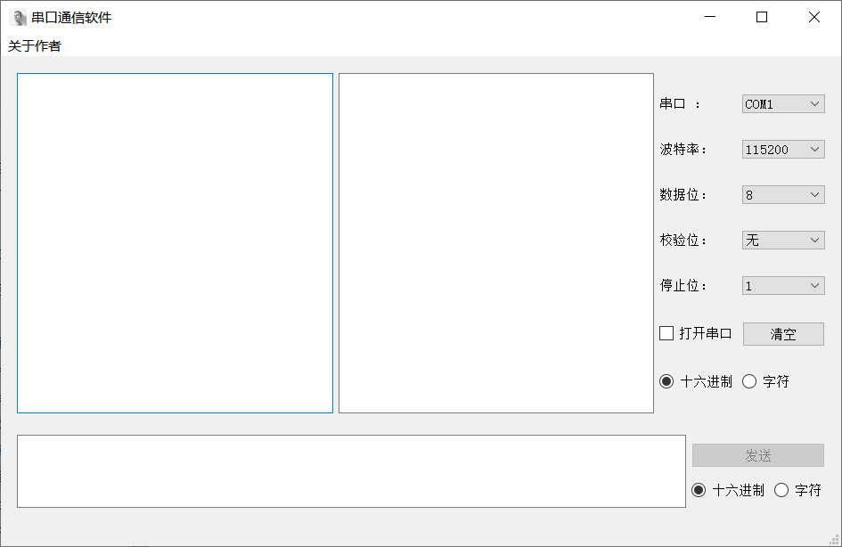
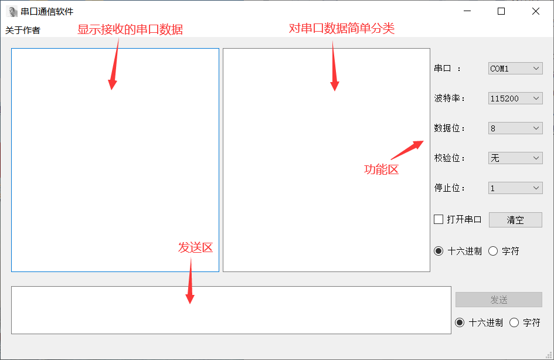
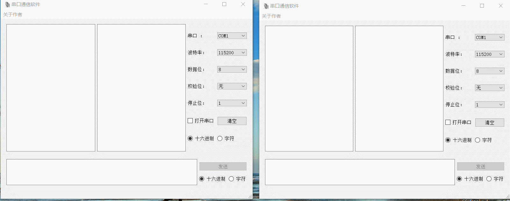

# SerialPort (串口通信软件)
[](https://github.com/Sanzona/SerialPort/stargazers)  [](https://github.com/Sanzona/SerialPort)  [](https://github.com/Sanzona/SerialPort/commits/master)

基于Qt开发的串口通信软件

## 软件介绍

### v1.0 






### v2.0








## 测试数据

```
# 光照传感器: 有无光照
EECC0201010000000000000000FF
EECC0201010000000000010000FF

# 人体检测传感器: 是否有人
EECC0701010000000000000000FF
EECC0701010000000000010000FF

# 三轴加速度传感器
EECC0801011232431232430000FF

# 温湿度传感器
EECC0A01010000431232430000FF

# 步进电机: 是否打开
EECC1001010000000000000000FF
EECC1001010000000000010000FF

# 声光报警器: 是否打开
EECC0E01010000000000000000FF
EECC0E01010000000000010000FF

# 继电器: 是否打开
EECC0F01010000000000000000FF
EECC0F01010000000000010000FF

```


